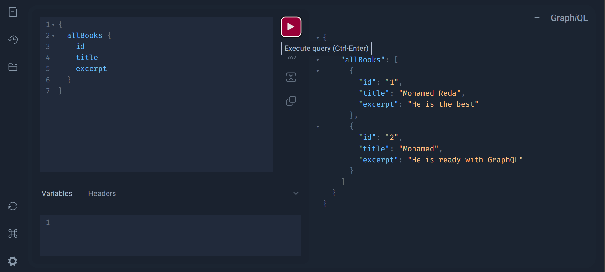
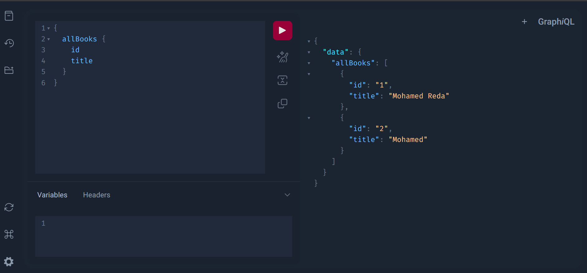
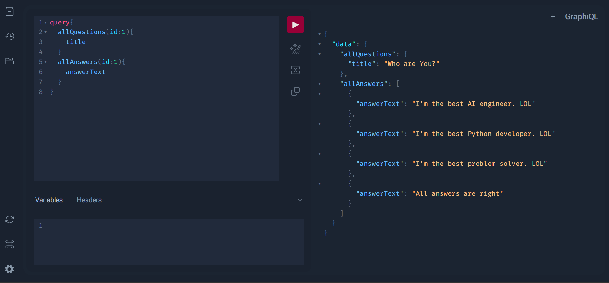

# Django GraphQL Books API

This project is a simple Django application with a GraphQL API for managing books.

## GraphQL Queries

Use the `/graphql` endpoint to run GraphQL queries like this:

```graphql
{
  allBooks {
    id
    title
    excerpt
  }
}
```





## Queries

**GraphQL Queries**

Use the `/` endpoint to run GraphQL queries like this:

```graphql
query{
  allQuestions(id:1){
    title
  }
  allAnswers(id:1){
    answerText
  }
}
```



## Commands

### 1. Set up the virtual environment

```bash
python -m venv venv
venv\Scripts\activate
```

### 2. Install dependencies

```bash
pip install -r requirements.txt 
```

### 3. Start the Django project

```bash
django-admin startproject core .
django-admin startapp books
```

### 4. Set up the `Books` model

Add the following `Books` model to `books/models.py`:

```python
from django.db import models


class Books(models.Model):
    title = models.CharField(max_length=100)
    excerpt = models.TextField()

    def __str__(self):
        return self.title
```

### 5. Create a GraphQL schema

In `books/schema.py`, define the GraphQL schema:

```python
import graphene
from graphene_django import DjangoObjectType
from .models import Books


class BooksType(DjangoObjectType):
    class Meta:
        model = Books
        fields = ("id", "title", "excerpt")


class Query(graphene.ObjectType):
    all_books = graphene.List(BooksType)

    def resolve_all_books(root, info):
        return Books.objects.filter(title="django")


schema = graphene.Schema(query=Query)
```

### 6. Register the `Books` model in the admin

In `books/admin.py`:

```python
from django.contrib import admin
from .models import Books

admin.site.register(Books)
```

### 7. Run migrations

After creating your models, run the following commands:

```bash
python manage.py makemigrations
python manage.py migrate
```

### 8. Run the local Django server

To start the server, use:

```bash
python manage.py runserver
```

If you encounter a port error, try:

```bash
python manage.py runserver 8080
```

### 9. Create an admin user

To create a superuser for the Django admin, run:

```bash
python manage.py createsuperuser
```

---

---

